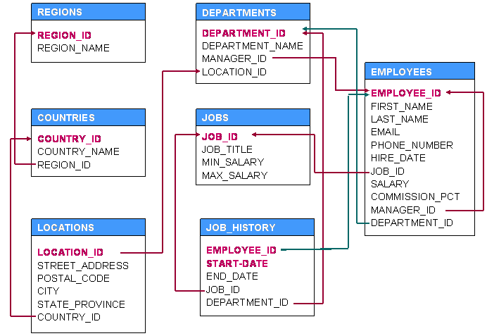

# Identificación

| Dato | Información |
| --- | --- |
| Nombre |  |
| Sección |  |
| Fecha |  |
| Curso | Base de Datos |
| Puntaje referencial | 36 puntos |

# Propósito

Esta prueba práctica permite ejercitar y afianzar los contenidos de consultas SQL de la Unidad 1. Contiene **36 preguntas**, distribuidas en **6 temas de 6 preguntas** cada uno. Los requerimientos aumentan gradualmente en complejidad y utilizan el mismo modelo relacional OEHR de la evaluación de Unidad 1.

# Instrucciones

1. Desarrolle la actividad de forma individual en Oracle SQL.
2. Cree un archivo llamado `nombre_apellido_practica_u1.sql`.
3. Escriba antes de cada solución un comentario con el número correspondiente; por ejemplo, `-- Pregunta 1`.
4. Utilice los nombres físicos de las tablas, todos con prefijo `OEHR_`.
5. Respete los alias de columna solicitados y use alias de tabla cuando intervenga más de una tabla.
6. No modifique los datos: todos los ejercicios se resuelven con `SELECT`.
7. Compruebe cada consulta antes de continuar. Una solución equivalente también es válida si entrega exactamente la información pedida.

# Caso

El equipo de Recursos Humanos de Oracle necesita ampliar la reportería de su aplicación. La gerencia solicita consultas que permitan revisar empleados, cargos, departamentos, ubicaciones e historial laboral. Para resolverlas, utilice el siguiente modelo relacional y determine las uniones a partir de sus claves primarias y foráneas.

{ width=92% }

En la figura los nombres aparecen sin prefijo; en la base de datos debe utilizar `OEHR_REGIONS`, `OEHR_COUNTRIES`, `OEHR_LOCATIONS`, `OEHR_DEPARTMENTS`, `OEHR_JOBS`, `OEHR_EMPLOYEES` y `OEHR_JOB_HISTORY`.

# Tema 1 — SELECT, expresiones, alias, concatenación y DISTINCT

## Pregunta 1

Muestre todos los datos registrados en `OEHR_DEPARTMENTS`.

## Pregunta 2

Muestre el código, nombre, apellido y sueldo de todos los empleados. Los encabezados deben ser `COD_EMPLEADO`, `NOMBRE`, `APELLIDO` y `SUELDO`.

## Pregunta 3

Muestre el código del empleado, su sueldo mensual, su sueldo anual y una simulación de sueldo anual que considere un bono mensual de 75 dólares. Use los alias `COD_EMPLEADO`, `SUELDO_MENSUAL`, `SUELDO_ANUAL` y `SUELDO_ANUAL_CON_BONO`.

## Pregunta 4

Genere para cada empleado una columna llamada `REPORTE` con el siguiente formato: `EL EMPLEADO Steven King TIENE COMO CARGO AD_PRES`.

## Pregunta 5

Muestre, sin repeticiones, los códigos de cargo presentes en `OEHR_EMPLOYEES`. El encabezado debe ser `CARGOS_VIGENTES`.

## Pregunta 6

Muestre el código, nombre, sueldo mínimo, sueldo máximo y diferencia salarial de cada cargo. La diferencia debe calcularse como sueldo máximo menos sueldo mínimo y llamarse `RANGO_SALARIAL`.

# Tema 2 — Restricción, operadores, patrones, nulos y ordenamiento

## Pregunta 7

Muestre código, apellido, sueldo y departamento de los empleados cuyo sueldo esté entre 5.000 y 10.000 dólares, ambos límites incluidos, y cuyo departamento sea 50 u 80. Ordene el resultado por sueldo de mayor a menor y luego por apellido de forma ascendente.

## Pregunta 8

Muestre código, apellido, fecha de contratación y comisión de los empleados contratados desde el 1 de enero de 2015 que no tengan comisión asociada. Ordene por fecha de contratación ascendente.

## Pregunta 9

Muestre código, nombre y apellido de los empleados cuyo apellido comience con la letra S o termine con la letra N, sin depender de cómo estén almacenadas las mayúsculas y minúsculas.

## Pregunta 10

Muestre código y nombre de los departamentos 10, 50 y 90. Ordene alfabéticamente por nombre de departamento.

## Pregunta 11

Muestre código, apellido, cargo y código de jefe de los empleados cuyo cargo no sea `AD_PRES`, `AD_VP` ni `SA_MAN`, y que sí tengan un jefe asociado.

## Pregunta 12

Muestre todos los datos de los departamentos cuyo nombre tenga la letra A como segundo carácter y termine con la letra S. La comparación no debe depender de mayúsculas o minúsculas.

# Tema 3 — Funciones de texto, número y fecha

## Pregunta 13

Muestre el código del empleado, su nombre completo en mayúsculas y su correo en minúsculas. Use los alias `COD_EMPLEADO`, `NOMBRE_COMPLETO` y `EMAIL`.

## Pregunta 14

Construya para cada empleado un correo con la primera letra del nombre, el apellido completo y el dominio `@rrhh.cl`, todo en minúsculas. Por ejemplo, Steven King debe producir `sking@rrhh.cl`. Llame `NUEVO_EMAIL` a la columna.

## Pregunta 15

Muestre el apellido, la cantidad de caracteres del apellido y los tres primeros caracteres del código de cargo. Use los alias `APELLIDO`, `LARGO_APELLIDO` y `AREA_CARGO`.

## Pregunta 16

Muestre el código, nombre completo, fecha de contratación y cantidad de semanas completas trabajadas hasta hoy. Use `SYSDATE`, elimine los decimales y llame `SEMANAS_TRABAJADAS` al resultado. Ordene desde quien lleva menos semanas hasta quien lleva más.

## Pregunta 17

Para cada empleado, muestre el sueldo, el sueldo dividido por 7 redondeado a dos decimales y el resto entero de dividir el sueldo por 7. Use los alias `SUELDO`, `CUOTA_REDONDEADA` y `RESTO_DIVISION`.

## Pregunta 18

Muestre el correo original y una versión en la que se elimine su penúltimo carácter y luego se agregue `@sql.cl`. Llame `EMAIL_PROPUESTO` a la nueva columna.

# Tema 4 — Conversión, formato, fechas y tratamiento de nulos

## Pregunta 19

Muestre código, apellido y sueldo de cada empleado, presentando el sueldo con símbolo de dólar, separador de miles y dos decimales. El encabezado del sueldo formateado debe ser `SUELDO_FORMATO`.

## Pregunta 20

Muestre código, apellido y fecha de contratación con el formato `31 DE AGOSTO DE 2022`. Use el alias `FECHA_CONTRATO` y presente el mes en mayúsculas.

## Pregunta 21

Muestre código, apellido y porcentaje de comisión para todos los empleados. Si la comisión es nula, reemplácela por cero; multiplique el valor por 100 y agregue el signo `%`. Use el alias `COMISION`.

## Pregunta 22

Muestre código, apellido y una columna `ESTADO_COMISION` que diga `CON COMISION` cuando `COMMISSION_PCT` no sea nulo y `SIN COMISION` cuando sea nulo. Resuelva con `NVL2`.

## Pregunta 23

Muestre código, apellido y año de contratación como un número de cuatro dígitos. Incluya solo a quienes fueron contratados después de 2015 y ordene el año de mayor a menor. Use explícitamente `TO_CHAR` y `TO_NUMBER`, y llame `ANIO_CONTRATACION` a la columna.

## Pregunta 24

Clasifique a los empleados según su sueldo mediante una expresión `CASE`: `TRAMO ALTO` para sueldos desde 10.000, `TRAMO MEDIO` para sueldos desde 5.000 y `TRAMO BAJO` para los restantes. Muestre código, apellido, sueldo y la clasificación con alias `TRAMO_SALARIAL`.

# Tema 5 — Funciones de grupo, GROUP BY y HAVING

## Pregunta 25

Muestre en una sola fila el sueldo promedio redondeado a cero decimales, el sueldo mínimo y el sueldo máximo de todos los empleados. Use los alias `PROMEDIO`, `MINIMO` y `MAXIMO`.

## Pregunta 26

Indique cuántos departamentos distintos tienen al menos un empleado. El encabezado debe ser `DEPARTAMENTOS_CON_EMPLEADOS`.

## Pregunta 27

Por cada cargo, muestre su código, cantidad de empleados, sueldo promedio redondeado a cero decimales y diferencia entre el sueldo máximo y mínimo. Incluya solo los cargos cuya diferencia sea distinta de cero. Use los alias `CARGO`, `CANTIDAD_EMPLEADOS`, `PROMEDIO_SUELDOS` y `DIFERENCIA_SUELDOS`.

## Pregunta 28

Muestre por departamento y cargo la suma de sueldos de los empleados pertenecientes a departamentos entre 50 y 100. Presente el total con formato monetario y ordene por departamento y cargo. Use los alias `COD_DEPARTAMENTO`, `CARGO` y `TOTAL_SUELDOS`.

## Pregunta 29

Muestre el código de los departamentos cuyo sueldo promedio sea superior a 8.000 dólares. Incluya el promedio redondeado a cero decimales y ordene desde el promedio más alto. Use los alias `COD_DEPARTAMENTO` y `PROMEDIO_SUELDOS`.

## Pregunta 30

Por cada cargo, muestre la cantidad total de empleados y la cantidad de empleados que tienen comisión. Incluya solo cargos con al menos dos empleados. Use los alias `CARGO`, `TOTAL_EMPLEADOS` y `EMPLEADOS_CON_COMISION`.

# Tema 6 — JOIN, claves foráneas, autorrelaciones y subconsultas

## Pregunta 31

Muestre código y nombre completo del empleado, nombre del cargo y nombre del departamento. Use las relaciones entre `OEHR_EMPLOYEES`, `OEHR_JOBS` y `OEHR_DEPARTMENTS`, y los alias de columna `COD_EMPLEADO`, `NOMBRE_EMPLEADO`, `CARGO` y `DEPARTAMENTO`.

## Pregunta 32

Muestre código y apellido del empleado, ciudad, país y región donde se ubica su departamento. Para ello recorra las claves foráneas desde `OEHR_EMPLOYEES` hasta `OEHR_REGIONS`. Use los alias `COD_EMPLEADO`, `APELLIDO`, `CIUDAD`, `PAIS` y `REGION`.

## Pregunta 33

Muestre el código y nombre completo de cada empleado junto con el nombre completo de su jefe directo. Deben aparecer también los empleados que no tienen jefe. Use los alias `COD_EMPLEADO`, `EMPLEADO` y `JEFE_DIRECTO`.

## Pregunta 34

Muestre el código y nombre de cada departamento junto con el nombre completo del empleado que lo dirige. Deben aparecer también los departamentos que no tienen jefe asignado. Use los alias `COD_DEPARTAMENTO`, `DEPARTAMENTO` y `JEFE_DEPARTAMENTO`.

## Pregunta 35

Muestre el código y apellido del empleado, fecha de inicio, fecha de término, nombre del cargo histórico y nombre del departamento histórico registrado en `OEHR_JOB_HISTORY`. Use los alias `COD_EMPLEADO`, `APELLIDO`, `FECHA_INICIO`, `FECHA_TERMINO`, `CARGO_HISTORICO` y `DEPARTAMENTO_HISTORICO`.

## Pregunta 36

Muestre código, nombre completo, departamento, cargo y comisión de los empleados que pertenezcan al mismo departamento que Whalen o King, tengan una comisión no nula y posean un sueldo fuera del rango de 5.000 a 10.000 dólares. Determine los departamentos mediante una subconsulta y ordene el resultado por departamento y apellido. Use los alias `COD_EMPLEADO`, `NOMBRE_EMPLEADO`, `DEPARTAMENTO`, `CARGO` y `COMISION`.

# Lista de comprobación final

- Respondí las 36 preguntas y numeré cada consulta.
- Usé las tablas y relaciones indicadas por el modelo OEHR.
- Diferencié `WHERE` de `HAVING` y evité productos cartesianos.
- Revisé el tratamiento de valores nulos.
- Ejecuté cada consulta y verifiqué sus alias y su ordenamiento.
