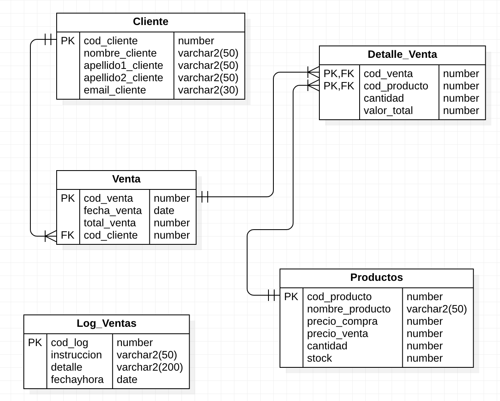

# Identificación

| Dato | Información |
| --- | --- |
| Nombre |  |
| Sección |  |
| Fecha |  |
| Curso | Base de Datos |
| Puntaje referencial | 80 puntos |

# Propósito y estructura

Esta práctica prepara para los ocho requerimientos de programación PL/SQL de la
ES2. Todos los ejercicios utilizan el modelo relacional de **Juanita's Market**
y el prefijo de trabajo `GIGH_`, que puede reemplazarse por las iniciales del
estudiante.

Cada sección corresponde a un requerimiento y contiene diez ejercicios:

- **Las primeras seis preguntas:** afianzamiento progresivo de la habilidad.
- **Las últimas cuatro preguntas:** desafíos que combinan objetos, validaciones,
  concurrencia, transacciones y excepciones.

Una solución equivalente es válida si respeta el modelo, los nombres solicitados
y el comportamiento indicado.

# Instrucciones

1. Resuelva cada ejercicio en Oracle PL/SQL y escriba antes de cada respuesta un
   comentario como `-- Pregunta 1`.
2. Utilice el prefijo `GIGH_` en tablas, restricciones, secuencias, triggers,
   funciones y procedimientos.
3. Ejecute los bloques PL/SQL con `/` después de cada definición.
4. Pruebe primero en un esquema de laboratorio y consulte los objetos compilados
   con `SHOW ERRORS`.
5. Controle las transacciones con `COMMIT` y `ROLLBACK`; no deje datos de prueba
   sin documentar.
6. Use `:NEW` y `:OLD` según el evento del trigger. Un trigger no debe ejecutar
   `COMMIT`, `ROLLBACK` ni `SAVEPOINT`.
7. Maneje las excepciones específicas antes de `WHEN OTHERS` y conserve el
   diagnóstico mediante `SQLCODE` y `SQLERRM`.
8. En cada procedimiento diferencie los parámetros (`_P`) de las columnas y
   aplique control de concurrencia cuando el requerimiento lo indique.

# Caso y modelo relacional

Juanita desea ampliar su peluquería con un minimarket. El sistema debe
administrar clientes, productos, ventas, detalles de venta y un registro de
operaciones. El diseño contiene las tablas `Cliente`, `Productos`, `Venta`,
`Detalle_Venta` y `Log_Ventas`.

{ width=88% }

En Oracle utilice los nombres físicos `GIGH_CLIENTE`, `GIGH_PRODUCTOS`,
`GIGH_VENTA`, `GIGH_DETALLE_VENTA` y `GIGH_LOG_VENTAS`. Las claves primarias son
`COD_CLIENTE`, `COD_PRODUCTO`, `COD_VENTA` y `COD_LOG`. La tabla de detalle tiene
clave primaria compuesta por `COD_VENTA` y `COD_PRODUCTO`.

\newpage

# Requerimientos de la ES2

1. Crear el modelo en SQL, incluyendo `CREATE TABLE`, `DROP TABLE` ordenados,
   claves primarias y foráneas.
2. Crear triggers que generen las claves primarias autoincrementales de clientes
   y productos.
3. Crear triggers que conviertan a mayúsculas los campos alfanuméricos de
   clientes y productos.
4. Crear el trigger `RECTIFICADOR` para actualizar los detalles cuando cambie el
   código de una venta.
5. Crear una función para correos con formato
   `NOMBRE.APELLIDO@JUANISMARKET.CL` y sufijo numérico para duplicados.
6. Crear un procedimiento integral de productos con opciones `R`, `U` y `D`.
7. Crear un procedimiento de inserción para clientes.
8. Crear una secuencia para la clave primaria de `LOG_VENTAS`.
\newpage

# Sección 1 — Modelo relacional y orden de objetos

**Habilidad central:** modelo físico, restricciones, dependencias y limpieza idempotente.
\Needspace{9cm}
## Pregunta 1 — Afianzamiento

Escriba los `CREATE TABLE` de `GIGH_CLIENTE` y `GIGH_PRODUCTOS` con sus columnas, tipos, claves primarias y restricciones de obligatoriedad.

\cajalarga
\Needspace{9cm}
## Pregunta 2 — Afianzamiento

Complete las tablas `GIGH_VENTA`, `GIGH_DETALLE_VENTA` y `GIGH_LOG_VENTAS`. Incluya la clave primaria compuesta del detalle.

\cajalarga
\Needspace{7cm}
## Pregunta 3 — Afianzamiento

Agregue las claves foráneas entre cliente–venta, venta–detalle y producto–detalle. Use nombres de restricciones con prefijo `GIGH_`.

\cajamedia
\Needspace{7cm}
## Pregunta 4 — Afianzamiento

Ordene los `DROP TABLE ... CASCADE CONSTRAINTS` para eliminar el modelo completo sin errores de dependencia.

\cajamedia
\Needspace{7cm}
## Pregunta 5 — Afianzamiento

Construya un script idempotente que capture ORA-00942 al intentar eliminar una tabla inexistente y relance cualquier otro error.

\cajamedia
\Needspace{9cm}
## Pregunta 6 — Afianzamiento

Inserte un registro válido en cada tabla y compruebe con consultas que las claves y relaciones quedaron creadas.

\cajalarga
\Needspace{10cm}
## Pregunta 7 — Desafío

Desafío: agregue restricciones `CHECK` para precios, cantidades, stock y totales, y demuestre con una inserción inválida qué excepción produce Oracle.

\cajaextra
\Needspace{10cm}
## Pregunta 8 — Desafío

Desafío: diseñe una versión del modelo que permita eliminar un cliente solo si no tiene ventas, explicando el efecto de la clave foránea.

\cajaextra
\Needspace{10cm}
## Pregunta 9 — Desafío

Desafío: escriba un bloque que consulte `USER_CONSTRAINTS` y `USER_CONS_COLUMNS` para listar las restricciones del modelo `GIGH_`.

\cajaextra
\Needspace{10cm}
## Pregunta 10 — Desafío

Desafío: integre limpieza, creación, carga mínima y consultas de verificación en un único script ejecutable desde un esquema vacío.

\cajaextra
\newpage

# Sección 2 — Secuencias y triggers autoincrementales

**Habilidad central:** secuencias, `:NEW`, claves automáticas y pruebas de generación.
\Needspace{9cm}
## Pregunta 11 — Afianzamiento

Cree `GIGH_SEQ_CLIENTE` con `START WITH 1`, incremento unitario y `NOCYCLE`.

\cajalarga
\Needspace{9cm}
## Pregunta 12 — Afianzamiento

Cree `GIGH_SEQ_PRODUCTO` con límites razonables para el crecimiento del minimarket.

\cajalarga
\Needspace{7cm}
## Pregunta 13 — Afianzamiento

Cree `GIGH_SEQ_LOG_VENTA` y documente por qué una secuencia no garantiza números consecutivos.

\cajamedia
\Needspace{7cm}
## Pregunta 14 — Afianzamiento

Implemente `GIGH_CLIENTE_AUTOINCREMENTAL` para asignar `NEXTVAL` cuando `:NEW.COD_CLIENTE` sea nulo.

\cajamedia
\Needspace{7cm}
## Pregunta 15 — Afianzamiento

Implemente `GIGH_PRODUCTO_AUTOINCREMENTAL` y pruebe dos inserciones sin indicar código.

\cajamedia
\Needspace{9cm}
## Pregunta 16 — Afianzamiento

Pruebe qué ocurre cuando se entrega un código explícito y explique por qué el trigger no debe reemplazarlo.

\cajalarga
\Needspace{10cm}
## Pregunta 17 — Desafío

Desafío: cree un trigger autoincremental para `GIGH_LOG_VENTAS` y registre tres operaciones usando la secuencia.

\cajaextra
\Needspace{10cm}
## Pregunta 18 — Desafío

Desafío: simule dos sesiones insertando clientes y explique por qué una secuencia evita que ambas obtengan el mismo código.

\cajaextra
\Needspace{10cm}
## Pregunta 19 — Desafío

Desafío: provoque un `ROLLBACK` después de consumir `NEXTVAL` y compruebe que el número puede quedar con un salto.

\cajaextra
\Needspace{10cm}
## Pregunta 20 — Desafío

Desafío: escriba un bloque que consulte `USER_SEQUENCES` y valide inicio, incremento, máximo, ciclo y caché de las secuencias.

\cajaextra
\newpage

# Sección 3 — Triggers de mayúsculas

**Habilidad central:** `BEFORE`, `INSERT`, `UPDATE`, `UPPER`, `TRIM` y valores nulos.
\Needspace{9cm}
## Pregunta 21 — Afianzamiento

Cree `GIGH_CLIENTE_MAYUSCULAS` para convertir nombre y apellidos a mayúsculas antes de insertar.

\cajalarga
\Needspace{9cm}
## Pregunta 22 — Afianzamiento

Amplíe el trigger para normalizar también `EMAIL_CLIENTE` y eliminar espacios laterales.

\cajalarga
\Needspace{7cm}
## Pregunta 23 — Afianzamiento

Cree `GIGH_PRODUCTO_MAYUSCULAS` para normalizar `NOMBRE_PRODUCTO` en inserciones.

\cajamedia
\Needspace{7cm}
## Pregunta 24 — Afianzamiento

Modifique ambos triggers para que funcionen en `INSERT OR UPDATE`.

\cajamedia
\Needspace{7cm}
## Pregunta 25 — Afianzamiento

Inserte nombres en minúsculas con espacios y compruebe el resultado almacenado.

\cajamedia
\Needspace{9cm}
## Pregunta 26 — Afianzamiento

Actualice un producto y un cliente con texto mixto y valide nuevamente la normalización.

\cajalarga
\Needspace{10cm}
## Pregunta 27 — Desafío

Desafío: maneje valores nulos sin convertirlos en una cadena vacía cuando la columna sea opcional.

\cajaextra
\Needspace{10cm}
## Pregunta 28 — Desafío

Desafío: agregue una validación que rechace nombres vacíos con `RAISE_APPLICATION_ERROR` y un código entre `-20030` y `-20039`.

\cajaextra
\Needspace{10cm}
## Pregunta 29 — Desafío

Desafío: normalice correos con `LOWER` en vez de `UPPER` y explique qué decisión es más adecuada para la presentación y la unicidad.

\cajaextra
\Needspace{10cm}
## Pregunta 30 — Desafío

Desafío: compruebe que los triggers no modifican las columnas numéricas de precios, cantidad o stock.

\cajaextra
\newpage

# Sección 4 — Trigger RECTIFICADOR

**Habilidad central:** actualización de claves, `:OLD`, `:NEW` y detalle de ventas.
\Needspace{9cm}
## Pregunta 31 — Afianzamiento

Cree una venta y un detalle asociado y consulte ambas tablas antes de modificar el código de venta.

\cajalarga
\Needspace{9cm}
## Pregunta 32 — Afianzamiento

Implemente `GIGH_RECTIFICADOR` como trigger `BEFORE UPDATE OF COD_VENTA` sobre `GIGH_VENTA`.

\cajalarga
\Needspace{7cm}
## Pregunta 33 — Afianzamiento

Actualice una venta de código 5 a 6 y compruebe que todos sus detalles adoptaron el código nuevo.

\cajamedia
\Needspace{7cm}
## Pregunta 34 — Afianzamiento

Pruebe una venta con dos productos y verifique que se actualizan varias filas del detalle.

\cajamedia
\Needspace{7cm}
## Pregunta 35 — Afianzamiento

Compruebe que un `UPDATE` sobre `FECHA_VENTA` no dispara la lógica de rectificación.

\cajamedia
\Needspace{9cm}
## Pregunta 36 — Afianzamiento

Muestre con una consulta la diferencia entre `:OLD.COD_VENTA` y `:NEW.COD_VENTA`.

\cajalarga
\Needspace{10cm}
## Pregunta 37 — Desafío

Desafío: controle que el nuevo código no exista antes de modificar la venta y genere un error personalizado.

\cajaextra
\Needspace{10cm}
## Pregunta 38 — Desafío

Desafío: maneje la actualización de una venta sin detalles y registre en `DBMS_OUTPUT` cuántas filas fueron afectadas.

\cajaextra
\Needspace{10cm}
## Pregunta 39 — Desafío

Desafío: explique cómo la actualización del detalle evita una violación de la clave foránea durante el cambio de código.

\cajaextra
\Needspace{10cm}
## Pregunta 40 — Desafío

Desafío: agregue una auditoría que registre en `GIGH_LOG_VENTAS` el código anterior, el nuevo código y la fecha del cambio.

\cajaextra
\newpage

# Sección 5 — Función de correos

**Habilidad central:** funciones, `SELECT INTO`, duplicados, sufijos y excepciones.
\Needspace{9cm}
## Pregunta 41 — Afianzamiento

Declare la estructura de `GIGH_GENERA_EMAIL` con parámetros de nombre y primer apellido y retorno `VARCHAR2`.

\cajalarga
\Needspace{9cm}
## Pregunta 42 — Afianzamiento

Genere el correo base con formato `NOMBRE.APELLIDO@JUANISMARKET.CL`.

\cajalarga
\Needspace{7cm}
## Pregunta 43 — Afianzamiento

Aplique `TRIM` y una normalización consistente de mayúsculas o minúsculas.

\cajamedia
\Needspace{7cm}
## Pregunta 44 — Afianzamiento

Consulte `GIGH_CLIENTE` para detectar si el correo base ya existe.

\cajamedia
\Needspace{7cm}
## Pregunta 45 — Afianzamiento

Agregue el sufijo `1` antes de la arroba cuando exista el correo base.

\cajamedia
\Needspace{9cm}
## Pregunta 46 — Afianzamiento

Extienda la lógica para producir los sufijos `2`, `3` y siguientes sin duplicar correos.

\cajalarga
\Needspace{10cm}
## Pregunta 47 — Desafío

Desafío: controle nombres o apellidos nulos con una excepción propia y `RAISE_APPLICATION_ERROR`.

\cajaextra
\Needspace{10cm}
## Pregunta 48 — Desafío

Desafío: elimine tildes y espacios internos de nombres y apellidos antes de construir el correo.

\cajaextra
\Needspace{10cm}
## Pregunta 49 — Desafío

Desafío: pruebe la función con cuatro clientes repetidos y muestre los cuatro correos generados.

\cajaextra
\Needspace{10cm}
## Pregunta 50 — Desafío

Desafío: explique la condición de carrera entre dos sesiones y proponga un bloqueo o una restricción `UNIQUE` para garantizar la integridad.

\cajaextra
\newpage

# Sección 6 — Procedimiento integral de productos R/U/D

**Habilidad central:** parámetros, DML, opciones, concurrencia, transacciones y log.
\Needspace{9cm}
## Pregunta 51 — Afianzamiento

Declare `GIGH_PRODUCTOS_RUD` con `OPCION_P` y parámetros para todos los datos del producto.

\cajalarga
\Needspace{9cm}
## Pregunta 52 — Afianzamiento

Implemente la opción `R` para insertar un producto usando la clave automática cuando corresponda.

\cajalarga
\Needspace{7cm}
## Pregunta 53 — Afianzamiento

Implemente la opción `U` para modificar precio de compra, precio de venta y stock mediante el código.

\cajamedia
\Needspace{7cm}
## Pregunta 54 — Afianzamiento

Implemente la opción `D` para eliminar un producto mediante el código.

\cajamedia
\Needspace{7cm}
## Pregunta 55 — Afianzamiento

Agregue `IF` o `ELSIF` para rechazar opciones distintas de `R`, `U` y `D`.

\cajamedia
\Needspace{9cm}
## Pregunta 56 — Afianzamiento

Use `SQL%ROWCOUNT` para informar cuando una actualización o eliminación no encontró el producto.

\cajalarga
\Needspace{10cm}
## Pregunta 57 — Desafío

Desafío: agregue `LOCK TABLE`, `COMMIT`, `ROLLBACK`, `DUP_VAL_ON_INDEX`, `VALUE_ERROR` y `WHEN OTHERS`.

\cajaextra
\Needspace{10cm}
## Pregunta 58 — Desafío

Desafío: registre cada operación en `GIGH_LOG_VENTAS` usando `GIGH_SEQ_LOG_VENTA` mediante su trigger.

\cajaextra
\Needspace{10cm}
## Pregunta 59 — Desafío

Desafío: valide que el precio de venta no sea menor que el precio de compra y que el stock no sea negativo.

\cajaextra
\Needspace{10cm}
## Pregunta 60 — Desafío

Desafío: impida eliminar productos que aparezcan en `GIGH_DETALLE_VENTA` y explique la excepción de integridad referencial.

\cajaextra
\newpage

# Sección 7 — Procedimiento de carga de clientes

**Habilidad central:** inserción integral, función de correo, concurrencia y manejo de errores.
\Needspace{9cm}
## Pregunta 61 — Afianzamiento

Declare `GIGH_CARGA_CLIENTE` con parámetros para código, nombre, apellidos y correo.

\cajalarga
\Needspace{9cm}
## Pregunta 62 — Afianzamiento

Inserte todos los campos de un cliente y permita que el trigger genere el código cuando sea nulo.

\cajalarga
\Needspace{7cm}
## Pregunta 63 — Afianzamiento

Use `GIGH_GENERA_EMAIL` cuando el correo no sea proporcionado por el llamador.

\cajamedia
\Needspace{7cm}
## Pregunta 64 — Afianzamiento

Permita recibir un correo explícito y compruebe la restricción `UNIQUE`.

\cajamedia
\Needspace{7cm}
## Pregunta 65 — Afianzamiento

Agregue `LOCK TABLE` y confirme una inserción correcta con `COMMIT`.

\cajamedia
\Needspace{9cm}
## Pregunta 66 — Afianzamiento

Capture `DUP_VAL_ON_INDEX`, `VALUE_ERROR` y errores inesperados con mensajes claros.

\cajalarga
\Needspace{10cm}
## Pregunta 67 — Desafío

Desafío: cree una excepción propia para nombre o apellido obligatorio y asígnela con `PRAGMA EXCEPTION_INIT`.

\cajaextra
\Needspace{10cm}
## Pregunta 68 — Desafío

Desafío: demuestre con dos llamadas iguales que la función genera correos diferentes sin intervención manual.

\cajaextra
\Needspace{10cm}
## Pregunta 69 — Desafío

Desafío: diseñe una prueba con `SAVEPOINT` que permita deshacer una carga sin perder una carga anterior válida.

\cajaextra
\Needspace{10cm}
## Pregunta 70 — Desafío

Desafío: documente cómo el bloqueo y la restricción `UNIQUE` trabajan juntos para resolver cargas concurrentes.

\cajaextra
\newpage

# Sección 8 — Secuencia y auditoría de LOG_VENTAS

**Habilidad central:** secuencia de log, trazabilidad, consultas y auditoría de DML.
\Needspace{9cm}
## Pregunta 71 — Afianzamiento

Cree `GIGH_SEQ_LOG_VENTA` y documente sus valores inicial, mínimo, máximo y política de ciclo.

\cajalarga
\Needspace{9cm}
## Pregunta 72 — Afianzamiento

Cree el trigger `GIGH_LOG_AUTOINCREMENTAL` para asignar `COD_LOG` automáticamente.

\cajalarga
\Needspace{7cm}
## Pregunta 73 — Afianzamiento

Inserte un log con instrucción, detalle y fecha sin indicar el código.

\cajamedia
\Needspace{7cm}
## Pregunta 74 — Afianzamiento

Registre manualmente las operaciones `PRODUCTOS_R`, `PRODUCTOS_U` y `PRODUCTOS_D`.

\cajamedia
\Needspace{7cm}
## Pregunta 75 — Afianzamiento

Consulte el log ordenado por `COD_LOG` y luego por `FECHAHORA`.

\cajamedia
\Needspace{9cm}
## Pregunta 76 — Afianzamiento

Muestre cuántas operaciones existen por tipo de instrucción mediante `GROUP BY`.

\cajalarga
\Needspace{10cm}
## Pregunta 77 — Desafío

Desafío: cree un trigger de auditoría de productos para registrar `INSERT`, `UPDATE` y `DELETE` con `USER`.

\cajaextra
\Needspace{10cm}
## Pregunta 78 — Desafío

Desafío: guarde en el detalle de auditoría el código de producto y, en una actualización, los valores anterior y nuevo del stock.

\cajaextra
\Needspace{10cm}
## Pregunta 79 — Desafío

Desafío: pruebe que un `ROLLBACK` elimina también el registro de auditoría creado dentro de la misma transacción.

\cajaextra
\Needspace{10cm}
## Pregunta 80 — Desafío

Desafío: construya un reporte diario del log con cantidad de operaciones, primera hora y última hora por tipo.

\cajaextra

# Lista de comprobación final

- [ ] Todas las tablas tienen el prefijo del estudiante.
- [ ] Los `DROP` respetan las dependencias entre claves foráneas.
- [ ] Los triggers usan correctamente `:NEW` y `:OLD`.
- [ ] Las secuencias se utilizan solo para generar identificadores.
- [ ] Los procedimientos diferencian parámetros y columnas.
- [ ] Cada operación DML tiene tratamiento de transacción.
- [ ] Las excepciones específicas aparecen antes de `WHEN OTHERS`.
- [ ] Se ejecutaron pruebas válidas, inválidas, duplicados y concurrencia.
- [ ] Cada requerimiento está separado con comentarios `--`.
